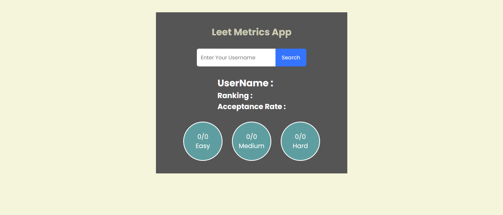
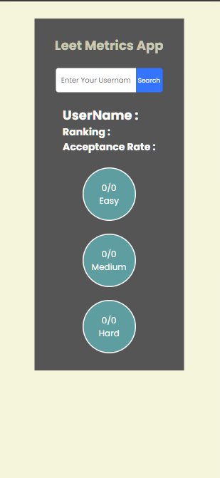

# 📊 Leet Metrix

Leet Metrix is a responsive web app built using **HTML, CSS, and JavaScript** to help you track and visualize coding progress with a clean, modern UI.  
The app is lightweight, fast, and adapts seamlessly across devices.

---

## 🔗 Live Demo
👉 [Check out the live app here](https://your-demo-link.com)

---

## 🚀 Features
- 📈 Track and display coding progress in an elegant way  
- 🎨 Clean and modern UI built with pure HTML, CSS, and JS  
- 📱 Fully responsive design for **desktop, tablet, and mobile**  
- ⚡ No external frameworks required  

---

## 🛠️ Tech Stack
- **HTML5** – Structure  
- **CSS3** – Styling & Responsiveness  
- **JavaScript (ES6+)** – Interactivity  

---

## 📷 Screenshots  

### 🖥️ Desktop View  
  

### 📱 Mobile View  
  

---

## 💡 Future Improvements
- 🌙 Dark mode support  
- 🔗 Integration with **GraphQL LeetCode library** for real-time problem stats  
- 📊 Advanced analytics & filtering  

---
